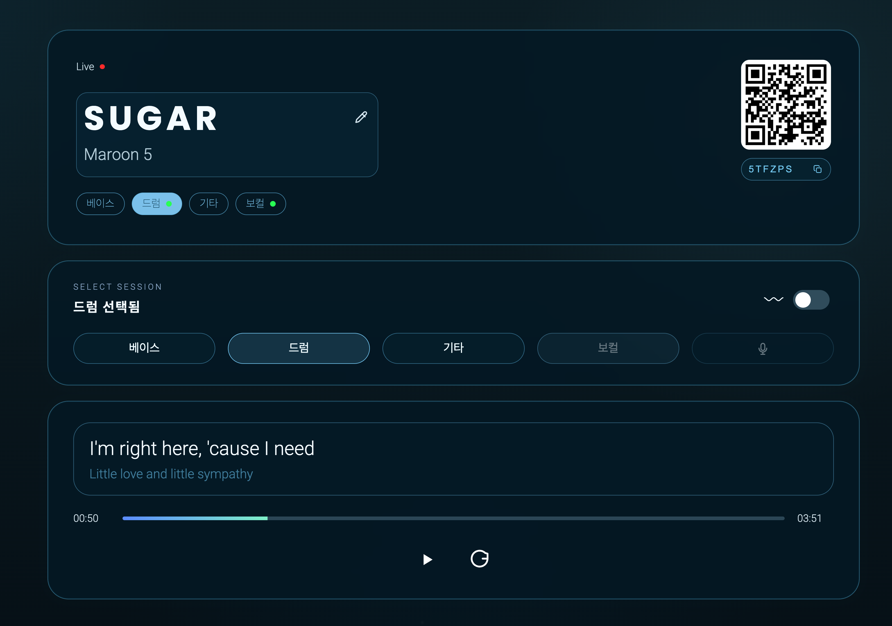

# 🎸딸깍톤 2026 -  Let's Jam
> 딸깍톤 프로젝트는 빠른 검증과 구현에 초점을 맞춰 MVP 형태로 진행했습니다.<br>
> 또한 짧은 개발 기간을 고려해 백엔드와 프론트를 하나의 저장소에서 함께 관리했습니다.

## 1. 프로젝트 개요

Let's Jam은 여러 명이 동시에 접속해 각자 다른 파트를 맡아 하나의 곡을 함께 만드는 인터랙티브 밴드 서비스입니다.

기존의 혼자 듣는 음악 경험이 아니라, 여러 사용자가 함께 참여하면서 곡을 완성하는 경험에 초점을 맞췄습니다.  
특히 특정 사용자가 먼저 보컬을 시작한 뒤, 이후에 들어온 다른 사용자의 악기 파트도 현재 재생 중인 시점에 맞춰 자연스럽게 합류할 수 있도록 구성했습니다.

또한 누군가 방을 나가면 해당 파트의 사운드가 함께 제거되도록 하여, 실제 합주에 가까운 흐름을 만들고자 했습니다.

## 2. 딸깍톤 - 해커톤
바이브 코딩 클럽에서 진행한 딸깍톤(해커톤)을 진행한 서비스입니다.  
짧은 시간 안에 아이디어 기획, 구현, 테스트까지 빠르게 진행하며 MVP 형태로 완성했습니다.

## 3. 팀원

| 이름 | 역할 |
|------|------|
| 신국현 | 백엔드 |
| 김장현 | 디자이너 |

## 4. AI 및 도구
### Codex
- 코드 생성, 로직 구현, 디버깅 과정에서 활용
### Gemini
- 기능 설계 보조 및 코드 작성, 아이디어 구체화에 활용(Google AI Studio 기반 개발 환경 활용)  

### Moises Studio
- 음원에서 보컬 및 악기 파트를 분리하는 데 사용
- 보컬, 드럼, 베이스 등 개별 악기 분리 가능
- 하나의 음원에서 여러 트랙(stem) 추출
- 분리된 음원을 기반으로 각 파트별 재생 기능 구현

## 5. 주요 기능

### 실시간 방 입장
- 사용자가 같은 방에 접속해 함께 음악에 참여할 수 있습니다.

### 파트 선택
- 보컬, 기타, 드럼, 피아노 등 원하는 파트를 선택할 수 있습니다.

### 재생 시점 동기화
- 먼저 재생 중인 곡의 진행 시점을 기준으로, 뒤늦게 참여한 파트도 같은 타이밍으로 맞춰 재생됩니다.

### 파트 상태 반영
- 특정 파트 사용자가 방을 나가면 해당 사운드가 즉시 제외됩니다.

### 참여형 인터랙션
- 단순 감상이 아니라 직접 참여해 곡을 완성하는 경험을 제공합니다.

## 6. 실행 방법
```
// root 경로에서 front, back 동시 실행
$ npm start
```

## 7. Let's Jam UI



## 8. Let's Jam 사용 방법
1. 방 생성
- 메인 화면에서 Create 버튼을 눌러 원하는 노래를 선택하면 방이 생성됩니다.
- 방이 생성되면 참여자들이 함께 연주할 수 있는 환경이 준비됩니다.

2. 연주 시작
- 방에 입장한 뒤 악기 또는 보컬을 선택하면 해당 파트의 음원이 자동으로 재생됩니다.
- 각 파트는 개별적으로 선택할 수 있으며, 여러 사용자가 동시에 참여해 하나의 곡을 완성할 수 있습니다.

3. 재생 방식 선택
- 악기 선택 창 우측에 있는 온오프 버튼을 통해 재생 방식을 변경할 수 있습니다.
- 자동 재생 모드
- 선택한 파트의 음원이 계속 재생됩니다.
- 모션 재생 모드
- 온오프 버튼을 활성화하면, 핸드폰을 흔들 때만 음원이 재생됩니다.
- 사용자의 편의에 따라 두 가지 방식 중 원하는 방식으로 선택해 즐길 수 있습니다.

4. 방 참여
- 방에 참여하는 방법은 두 가지입니다.
- Join 버튼 → 코드 입력
- 방 생성자가 제공한 QR 코드 스캔
- 코드 입력 또는 QR을 통해 동일한 방에 접속하면 다른 사용자들과 함께 연주를 이어갈 수 있습니다.
